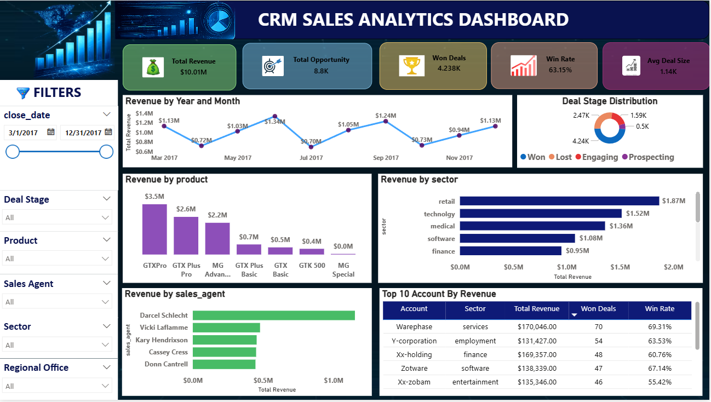

# Customer Relationship Management Dashboard

## Overview
This project presents an interactive CRM Dashboard built using Power BI. The dashboard provides insights into customer demographics, purchasing behavior, spending patterns, and marketing campaign effectiveness.

## Tools Used
- Power BI
- Excel/CSV
- DAX
- Power Query

## Key KPIs
- Total Customers
- Total Revenue
- Average Customer Income
- Campaign Response Rate
- Product-wise Spending
- Purchase Channel Analysis

## Features
- Customer Segmentation
- Sales Analysis
- Marketing Campaign Performance
- Interactive Filters and Slicers
- Business Insights Dashboard

## Key Insights
- Revenue is concentrated among high-income customers.
- Wine products generate the highest spending.
- Customers aged 35–55 contribute the largest share of sales.
- Campaign response rates vary across customer segments.

## Skills Demonstrated
- Power BI
- DAX
- Power Query
- Data Cleaning
- Data Visualization
- Business Intelligence
- Customer Analytics

## Dataset
Customer Personality Analysis Dataset from Kaggle.
Dataset Link:
https://www.kaggle.com/datasets/imakash3011/customer-personality-analysis

## Dashboard Preview

## Author
Jyoti Ratnappa Ganiger
